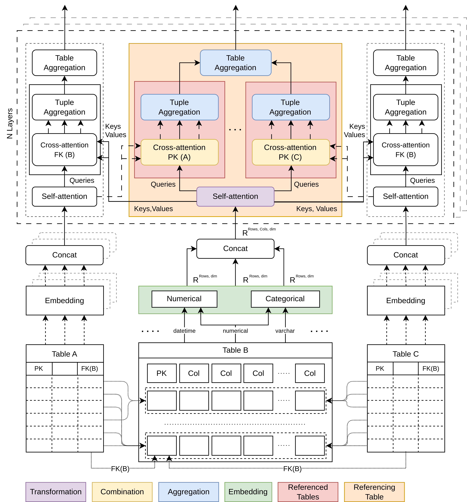

# Deep Learning for Relational Databases

This repository contains code accompanying the paper [A Deep Learning Blueprint for Relational Databases](https://nips.cc/virtual/2023/81289)

**TL;DR:**  
A modular neural message-passing scheme reflecting the _relational model_ for **end-to-end deep learning from databases**

## About

The system allows to easily connect to any database through a simple connection string (with [SQL Alchemy](https://www.sqlalchemy.org/)), load information from the DB (with [Pandas](https://pandas.pydata.org/)), _**automatically analyze**_ its schema structure and data columns' semantics, and efficiently load and embed the data into learnable ([torch](https://pytorch.org/)) tensor representations.

The subsequent modular neural message-passing scheme operating on top of the resulting (two-level) _multi-relational hypergraph representation_ then builds on [Pytorch Geometric](https://pyg.org/), allowing to easily use any of its modules in the respective functional interfaces (_transformation, combination, aggregation_) of the deep relational message-passing blueprint:



For more information please read the paper and/or feel free to [reach out](https://github.com/LukasZahradnik/deep-db-learning/discussions) directly to us!

### Project Structure

- `db_transformer` - the main module containing the:
  -  `data` - loading, analysis, conversion, and embedding
  -  `db` - connection, inspection, and schema detection
  -  and the transformer-based instantiation of the blueprint
- `experiments` - presented in the paper, including baselines from:
  - Tabular models
  - Propositionalization
  - Statistical Relational Learning
  - Neural-symbolic integration
and additionally some:
- `datasets` - some selected DB datasets for debugging
- `examples` - example scripts on data schema detection/conversion

If you like the idea, you can cite the paper as:
```
@inproceedings{zahradnik2023deep,
  title={A Deep Learning Blueprint for Relational Databases},
  author={Zahradn{\'\i}k, Luk{\'a}{\v{s}} and Neumann, Jan and {\v{S}}{\'\i}r, Gustav},
  booktitle={NeurIPS 2023 Second Table Representation Learning Workshop},
  year={2023}
}
```

### Related


There is also [PyNeuraLogic](https://github.com/LukasZahradnik/PyNeuraLogic) framework that allows for a more direct/flexible [_deep relational learning_](https://medium.com/tag/deep-relational-learning) with the DB relations (and more).